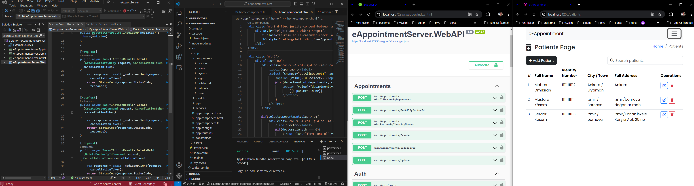
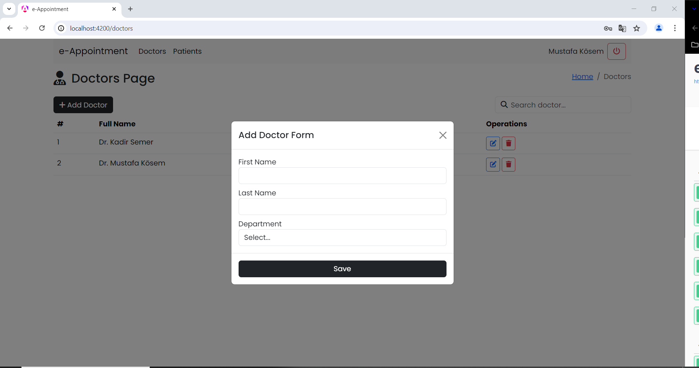
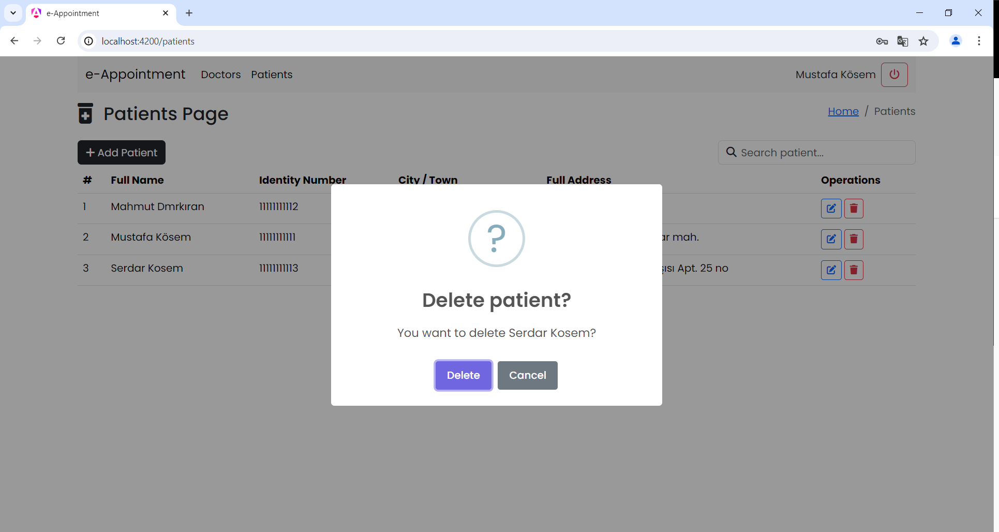
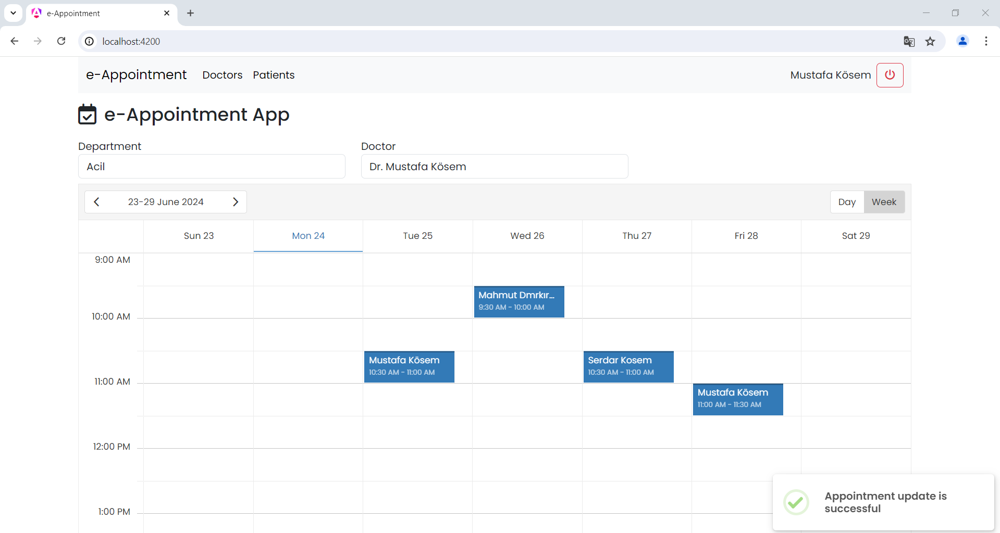
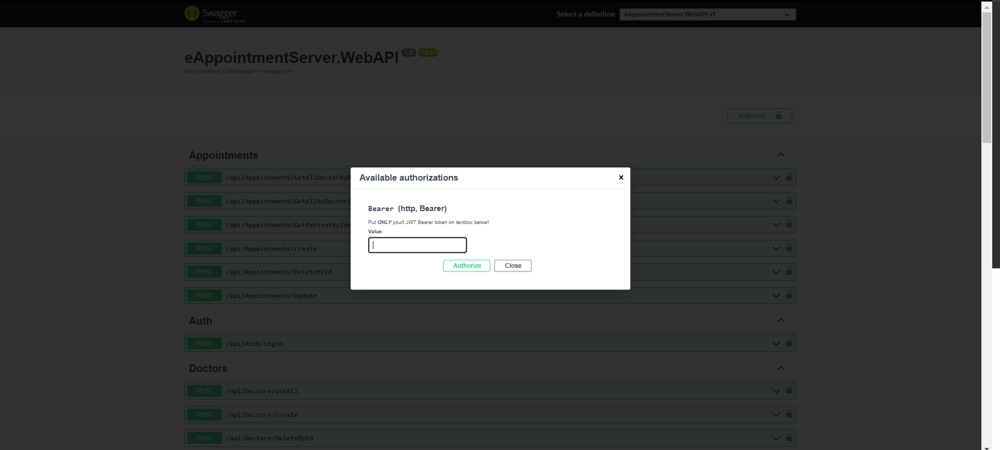

# Fullstack-eAppointment

Fullstack-eAppointment, Clean Architecture ve Angular kullanılarak geliştirilmiş online randevu yönetim sistemidir. Projede modüler yapıda tasarlanmış olup, aşağıdaki başlıkları içermektedir:

## Proje Amaçları

- Kullanıcıların randevu oluşturma, yönetme ve görüntüleme işlemlerini kolayca yapabileceği bir platform sağlamak.
- Katmanlı mimari ve Clean Architecture prensipleri ile yazılımın sürdürülebilirliğini ve test edilebilirliğini artırmak.
- CQRS pattern kullanarak veritabanı işlemlerini yönetmek.

## Teknolojiler

### Backend
- **ASP.NET Core**: Web uygulamaları için kullanılan açık kaynaklı bir web çerçevesi.
- **Entity Framework Core**: .NET uygulamaları için bir ORM (Object-Relational Mapping) çerçevesi.
- **MediatR**: Mediator deseni için bir kütüphane, CQRS uygulamalarında kullanılır.
- **Fluent Validation**: .NET uygulamaları için nesne doğrulama kütüphanesi.
- **JWT Authentication**: JSON Web Token tabanlı kimlik doğrulama.
- **Scrutor**: Bağımlılık enjeksiyonu için hizmet tarama kütüphanesi.

### Frontend
- **Angular**: TypeScript tabanlı bir web uygulama çerçevesi.
- **Bootstrap**: Web siteleri ve web uygulamaları için tasarım şablonları ve kullanıcı arabirimi bileşenleri.
- **Fontawesome**: Vektör ikon kütüphanesi.
- **Toastr**: Bildirim mesajları için bir kütüphane.
- **Sweetalert**: Daha iyi ve özelleştirilebilir JavaScript uyarıları.

## Kurulum

1. **Backend'i başlatın:**
   ```sh
   cd server
   dotnet restore
   dotnet run
   ```
2. **Frontend'i başlatın:**
      ```sh
    cd client
    npm install
    ng serve
   ```
3. **Veritabanı için:**
     ```sh
    Veritabanı bağlantısını appsettings.json dosyasında yapılandırın.
    Helper.cs dosyasında giriş bilgilerinizi yapılandırın.
      ```







## Proje İçeriği ve İlerleme
### Backend - Domain Katmanını Oluşturma
-	Entity – AppUser, Patient, Doctor, Appointment,AppRole,AppUserRole 
-	Repository Pattern
### Backend - Application Katmanını Oluşturma
-	Dependency Injection
-	MediatR Kütüphanesi ve DI
-	Result Pattern
-	Auth - Login
- Json Web Token
### Backend - Infrastructure Katmanı Oluşturma
-	Dependency Injection
-	Entity Framework Core ile Context Yapısı
-	Repositories ve UnitOfWork
-	Scrutor Kütüphanesi ile DI

### Backend - WebAPI Katmanı Oluşturma
-	SQL Connection ve Code First ile Db
-	Cors Policy
-	Login Endpoint
-	Base API Controller

### Frontend - Angular Projesi Oluşturma
-	Angular Projesi Oluşturma
-	Layout Yapısı ve Routing
-	Bootstrap ve Fontawesome
-	Login Sayfası Tasarımı
-	Görsel Sayfaların Tasarımı ve CRUD İşlemleri
-	Generic HTTP Service
-	Authentication Kontrolü
-	Sweetalert ile Toast ve Question
-	Error Handler

